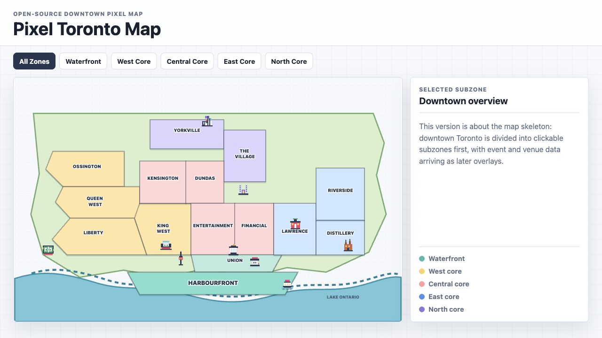

# Pixel Toronto Map

An open-source, pixel-inspired map of downtown Toronto. It is intentionally stylized rather than GIS-accurate: the goal is a local town-map feel that can support future event overlays, guides, and community projects.



## What is included

- Clickable downtown zones
- Expanded subzone boards
- Pixel-style landmark icons
- Lightweight static HTML/CSS/JavaScript
- JSON data files for zones and subzones

## Why this exists

Most maps are either too literal, too corporate, or too heavy for small community projects. This repo is a reusable visual base for Toronto projects that need a playful but useful neighborhood map.

Possible overlays include:

- festival guides
- matchday and watch-party maps
- food and patio crawls
- neighborhood event listings
- local civic or cultural projects

## Open source

Pull requests are welcome. Good contributions include:

- improving the pixel shapes of zones or subzones
- tuning local neighborhood names
- adding or refining landmark icons
- improving accessibility and keyboard behavior
- creating new visual themes
- proposing cleaner data structures for future city/event overlays

The map is a first pass, not a final authority. Local knowledge is welcome.

## Local preview

Serve the folder with any static server:

```sh
python3 -m http.server 5175 --bind 127.0.0.1
```

Then open:

```txt
http://127.0.0.1:5175
```

## Project direction

This repository is the reusable map foundation. Event-specific data, such as watch parties, screenings, venue lists, or festival overlays, should live in separate projects or data layers that build on top of this map.

The long-term idea is to keep the rendering and data model general enough that other cities could eventually build their own pixel-map views too.
